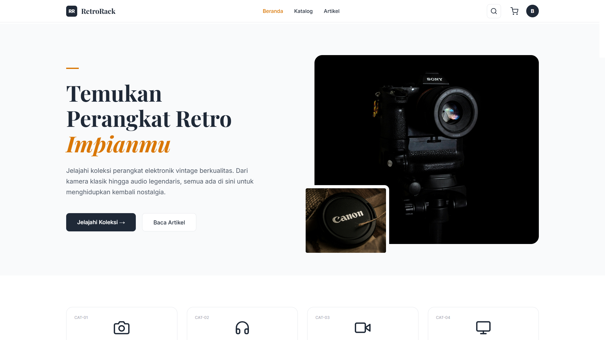
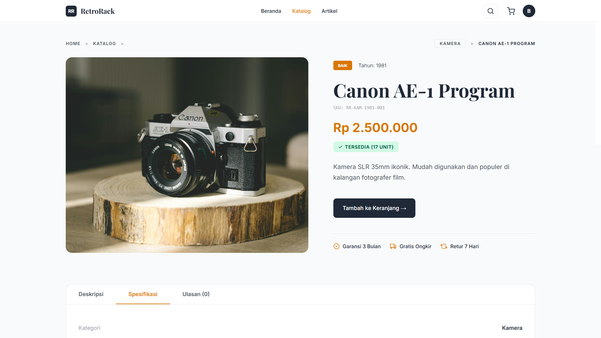
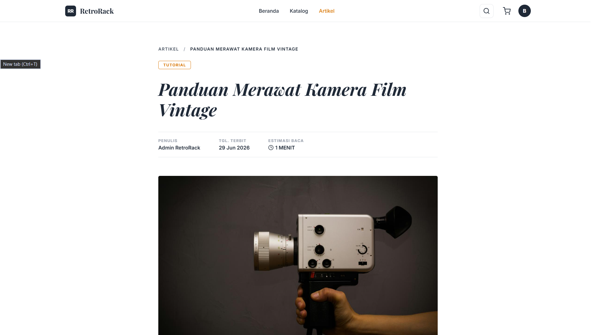
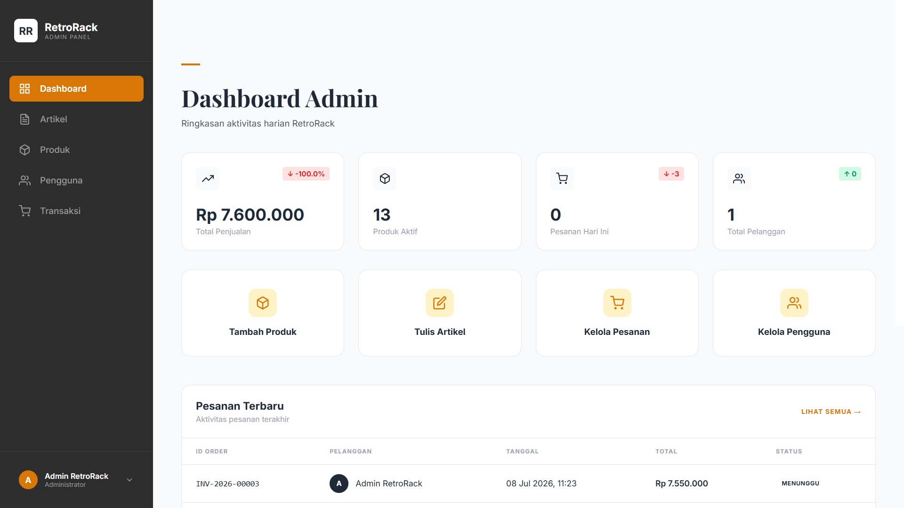

# Retro Rack

A full-featured e-commerce and inventory management system dedicated to vintage and retro merchandise. Built to handle product catalogs, detailed informational articles, and seamless administrative control over store assets.

## Tech Stack

- **PHP 8.3**
- **Laravel 13**
- **Laravel Breeze** (Authentication)
- **SQLite** (Default database)
- **Vite** + **Tailwind CSS** (Frontend styling and bundling)

## Features

- **User Authentication** — Secure login, registration, and session management powered by Laravel Breeze.
- **Product Catalog** — Browse, filter, and view details for vintage items with an intuitive UI.
- **Editorial Articles** — Integrated blogging/article system for vintage maintenance guides and lore.
- **Admin Management Dashboard** — Centralized interface for administrators to manage inventory, update articles, and oversee platform activity.

## Setup

1. Clone repository.
2. Install dependencies and initialize:
    ```sh
    composer setup
    ```
    _(Runs composer install, env setup, key generate, migrate, npm install, npm run build)_
3. Start dev server:
    ```sh
    composer dev
    ```

## Test Accounts

- **User:** `user@mail.com` / `12345678`
- **Admin:** `admin@mail.com` / `12345678`

## Screenshots





